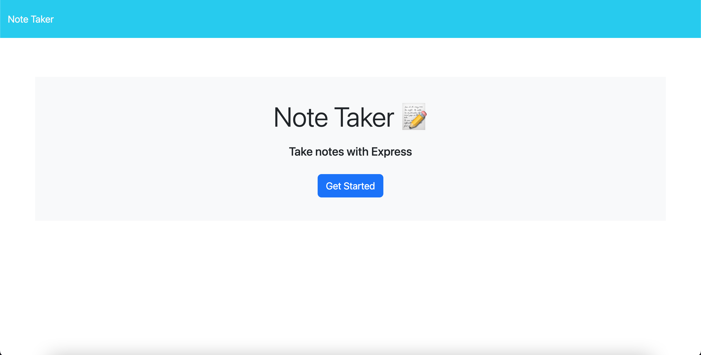
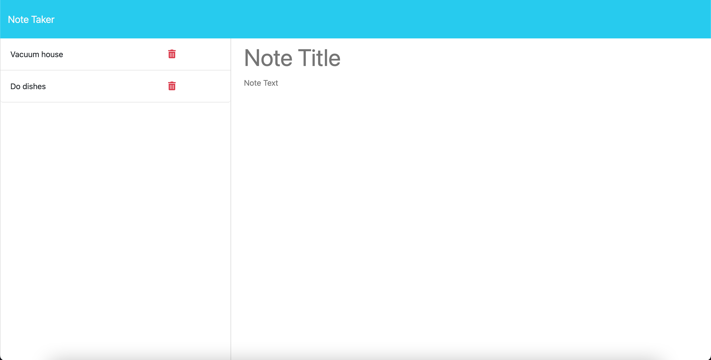
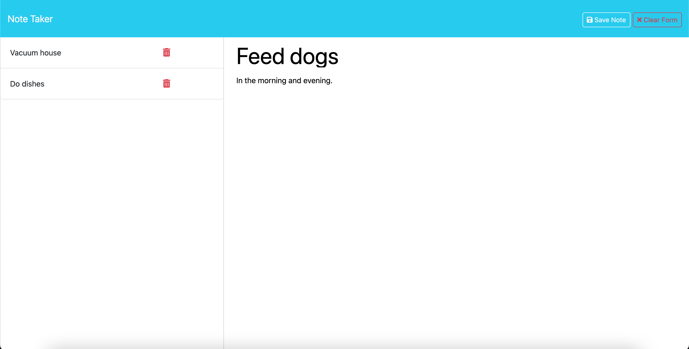
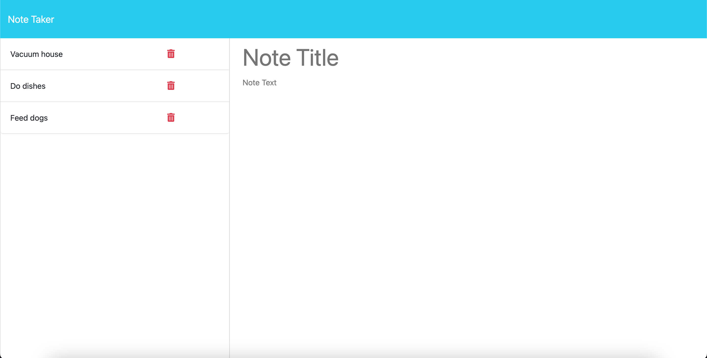

# Challenge 11: Express.js Note Taker


## Description

For this challenge, we were given starter code for the front end and we had to build the back end and connect them using express. While building the code, I was able to check if my POST and GET functions were running properly using Insomnia. Once the application had been built out and working correctly, we then had to deploy our page to Heroku. Here were the User Story and Acceptance Criteria.

## User Story

```md
AS A small business owner
I WANT to be able to write and save notes
SO THAT I can organize my thoughts and keep track of tasks I need to complete
```

## Acceptance Criteria

```md
GIVEN a note-taking application
WHEN I open the Note Taker
THEN I am presented with a landing page with a link to a notes page
WHEN I click on the link to the notes page
THEN I am presented with a page with existing notes listed in the left-hand column, plus empty fields to enter a new note title and the note’s text in the right-hand column
WHEN I enter a new note title and the note’s text
THEN a "Save Note" button and a "Clear Form" button appear in the navigation at the top of the page
WHEN I click on the Save button
THEN the new note I have entered is saved and appears in the left-hand column with the other existing notes and the buttons in the navigation disappear
WHEN I click on an existing note in the list in the left-hand column
THEN that note appears in the right-hand column and a "New Note" button appears in the navigation
WHEN I click on the "New Note" button in the navigation at the top of the page
THEN I am presented with empty fields to enter a new note title and the note’s text in the right-hand column and the button disappears
```

## Deployed Application Link
https://ash-express-note-taker-0c03496eb057.herokuapp.com/

## Screenshots of Page

Landing page

Notes page with existing notes

Adding a new note

New note added to existing notes area

New note having been deleted


## Table of Contents

- [Installation](#installation)
- [Usage](#usage)
- [Contributing](#contributing)
- [Tests](#tests)
- [License](#license)
- [Questions](#questions)

## Installation

Once this repo has been cloned to your local system and opened in VS Code, you will need to install express. In your terminal, run `npm i` and it will install the necessary packages.

## Usage

To see your local server, run `npm start` and it will give you a link.

## Contributing

N/A

## Tests

To test out the GET, POST, and DELETE functions of express, you can run the local host server in Insomnia with the corresponding links and options.

## License
MIT License

---

## Questions

Any questions you may have, please feel free to reach out to me using either contact.<br>
GitHub Profile: https://github.com/ashpfander<br>
Email: ashmpfander@gmail.com